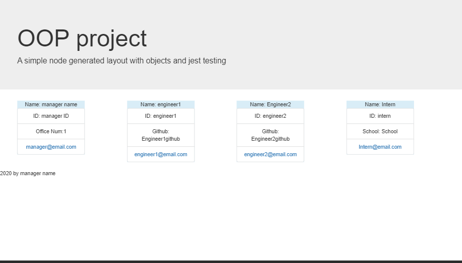

This project uses object oriented programing to create four objects, and have a user generate the values for the key pairs. These objects are then pushed into an array and dynamically generate a page that displays the information. 

At the moment the site is designed to convey cards that relate to individual workers in a company, I.E. Manager; Engineers; and Interns. It displays the pertinent information for each in a card. The layout is as simple as possible to allow for a more intuitive undersatanding of the objects and the inquirer prompts they link to so the content can be edited to whatever a user might need.

While it is possible to create this type of form without objects (see the original solve folder for an file that does the same job without need of objects) the objects allow for a more modular and hopefully easier to maintain code foundation. All tests check to see that the arrays are being populated correctly for each object class. 

https://www.youtube.com/watch?v=54a-TcVfrU0&feature=youtu.be
